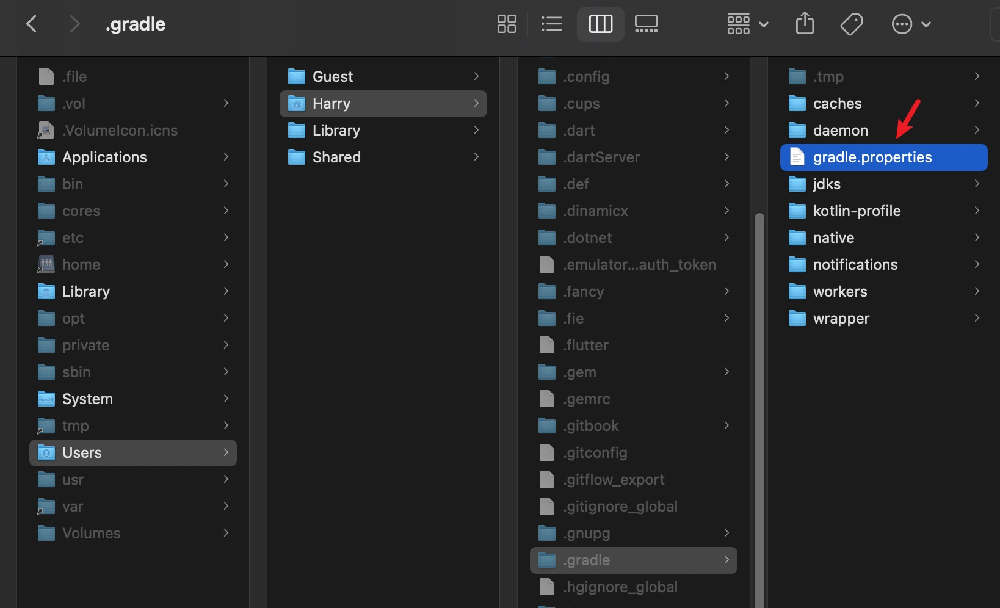
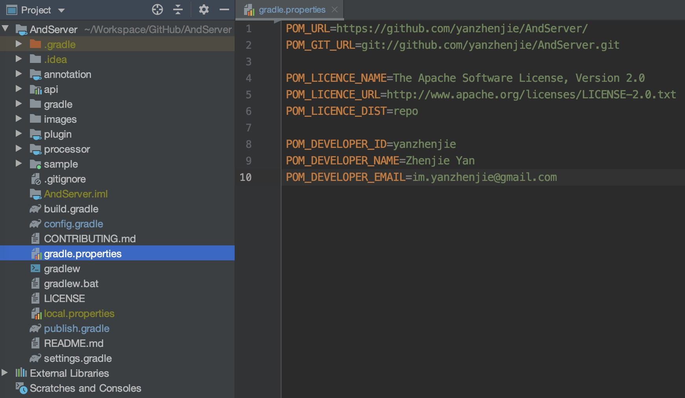
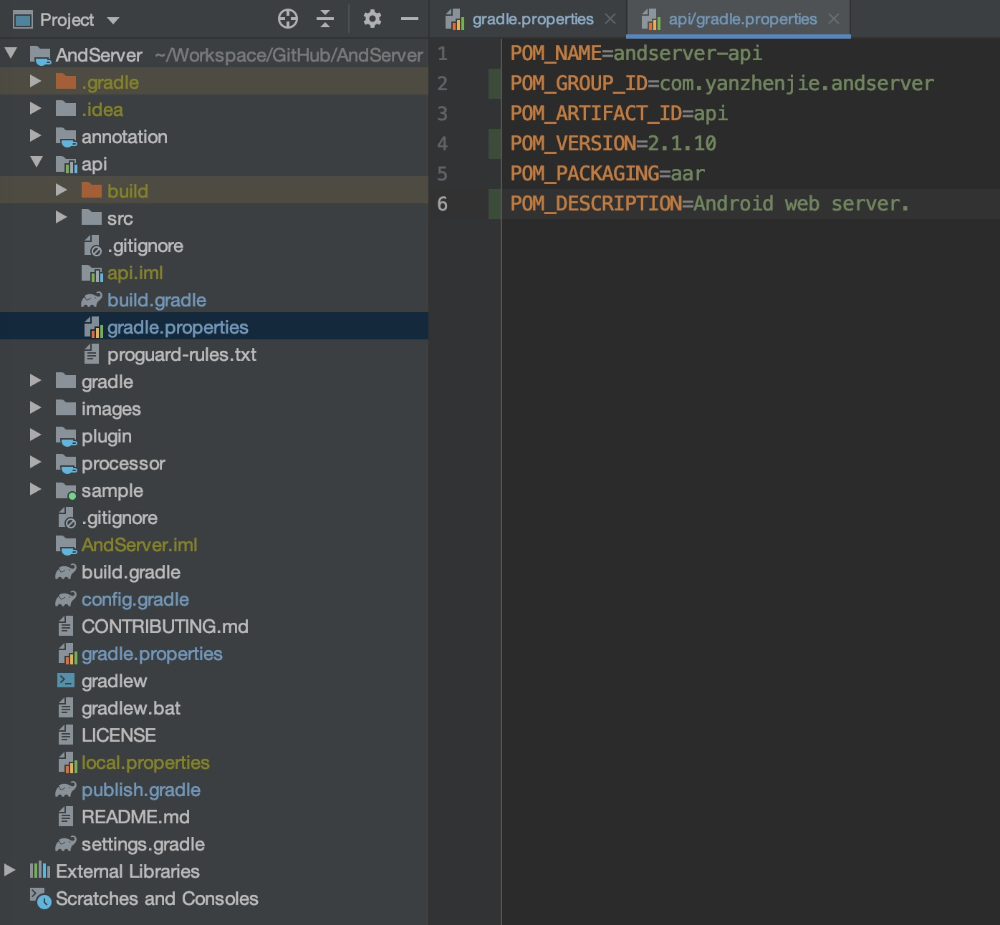
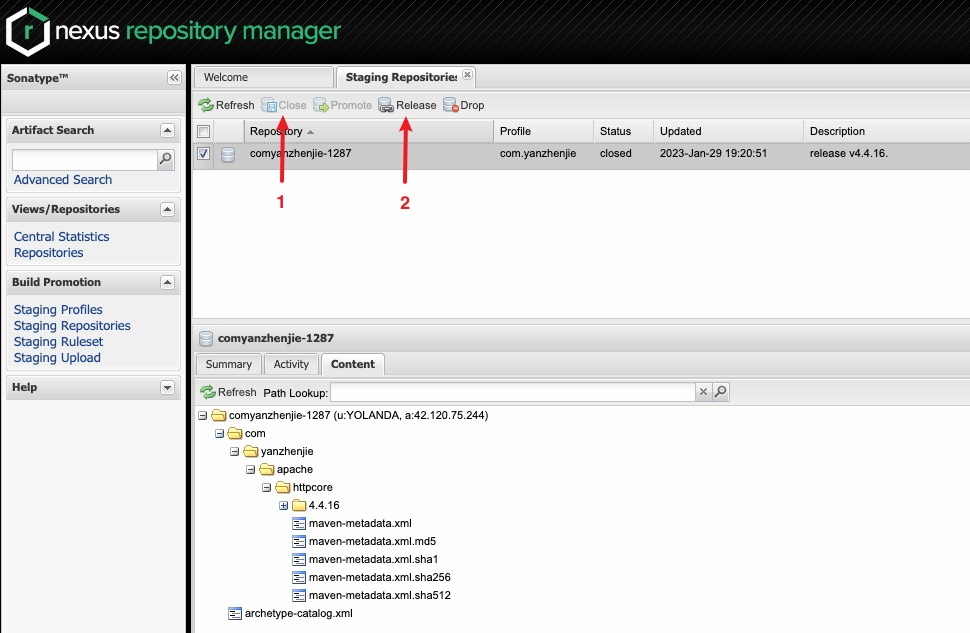

# 使用 Gradle 发布 Java/Android 项目到 MavenCentral

1、在要发布的模块的 gradle 脚本中应用本仓库提供的发布脚本：

```groovy
apply plugin: 'java'
// OR: apply plugin: 'java-library'
// OR: apply plugin: 'com.android.library'

dependencies {
   ...
}

// This.
apply from: 'https://raw.githubusercontent.com/yanzhenjie/GradleToMaven/master/publish.gradle'
```

2、在本地文件配置 SONATYPE 账号和签名信息



打开这里的`gradle.properties`文件（没有则创建），把一些私有不能上传到 git 的个人私有常量配置在这里：

```properties
SONATYPE_USERNAME=xxx
SONATYPE_PASSWORD=xxxxxxx

signing.keyId=AEBB6C36
signing.password=xxxxxxxx
signing.secretKeyRingFile=/Users/Harry/.gnupg/secring.gpg
```

3、在 project 配置 modules 公有的仓库信息



一个项目中可能有好几个 module，每个 module 配置一遍就有点浪费了，所以在根项目的`gradle.properties`文件配置 module 公共常量：

```properties
POM_URL=https://github.com/yanzhenjie/AndServer/
POM_GIT_URL=git://github.com/yanzhenjie/AndServer.git

POM_LICENCE_NAME=The Apache Software License, Version 2.0
POM_LICENCE_URL=http://www.apache.org/licenses/LICENSE-2.0.txt
POM_LICENCE_DIST=repo

POM_DEVELOPER_ID=yanzhenjie
POM_DEVELOPER_NAME=Zhenjie Yan
POM_DEVELOPER_EMAIL=im.yanzhenjie@gmail.com
```

4、配置每个 module 的私有信息



每个 module 的 GAV 都不一样，这些常量需要每个 module 单独配置：

```properties
POM_NAME=andserver-api

POM_GROUP_ID=com.yanzhenjie.andserver
POM_ARTIFACT_ID=api
POM_VERSION=2.1.10
POM_PACKAGING=aar

POM_DESCRIPTION=Android web server.
```

如果是`java`或者`java-libaray`模块，那么这里写法注意下：

```properties
...
POM_PACKAGING=jar
...
```

5、发布模块

发布到本地的 maven 仓库：

```shell
./gradlew clean assemble publishToMavenLocal
```

上传到 MavenCentral：

```shell
./gradlew clean assemble publish
```

如果要发布 snapshot 版本，只要把版本号改成`-SNAPSHOT`结尾的即可，比如：

```properties
POM_VERSION=2.1.10-SNAPSHOT
```

上面的命令执行时会发布当前项目下的所有 modules，如果要发布某个指定 module，比如要发布`AndServer`下的`api`模块：

```shell
./gradlew clean :api:assemble :api:publish
```

6、在 sonatype 发布包到 maven 仓库

注意到上面提到`上传到 MavenCentral`，而不是`发布到 MavenCenteral`，是因为我们只是把代码编译打包后做了上传，没有真正的发布到 maven 仓库，需要手动操作一下。



这里需要 2 步。

第 1 步，首先选中要发布的包，注意打开下面的 content 检查下内容是否正确，然后点击 Close，把这个包关闭掉。

第 2 步，在 Close 成功后（有可能会失败，注意检查，失败则重试），再次选中要发布的包，点击 Release 释放包到 Maven 仓库（有可能会失败，注意检查，失败则重试）。

这样就完成了所有发布。

## License

```text
Copyright Zhenjie Yan

Licensed under the Apache License, Version 2.0 (the "License");
you may not use this file except in compliance with the License.
You may obtain a copy of the License at

   http://www.apache.org/licenses/LICENSE-2.0

Unless required by applicable law or agreed to in writing, software
distributed under the License is distributed on an "AS IS" BASIS,
WITHOUT WARRANTIES OR CONDITIONS OF ANY KIND, either express or implied.
See the License for the specific language governing permissions and
limitations under the License.
```
